# Architecture and review order

The public workflows are documented in the [README](../README.md). This page maps those workflows to the implementation and the invariants a reviewer should check. The project remains a repository-local script collection with three native executables; it does not add a plugin system or a model backend.

```mermaid
flowchart LR
    Source[Source rows and profile] --> Reference[Native reference generation]
    Reference --> Dataset[Validated dataset and audit records]
    Dataset --> Collection[Python collection lifecycle]
    Collection --> Native[Native teacher forcing and metrics]
    Native --> Artifacts[Completed metrics and provenance]
    Artifacts --> Guards[Paired collection guards]
    Guards --> Inference[Statistical engine]
    Inference --> Reports[CLI report rendering]
```

## Reference generation

Start in [cli/generate_reference.py](../cli/generate_reference.py). `generate` keeps the output-state and exception boundary visible. Named helpers prepare source requests, archive the generator, record model identities and classify the generated rows. Request preparation retains source order, original image bytes and explicit thinking settings. Row classification must partition requested IDs into eligible, repetition-excluded and failed sets without silently replacing rows.

[core/reference.cpp](../core/reference.cpp) separates `parse_reference_args`, `run_requests` and `main`. The request loop preserves per-row exception handling, slot order and exit status. `reference_context` owns model/context/sampler state. Its preparation, generation and MTP methods remain together so a reviewer can trace token acceptance and KV ownership without crossing unrelated wrappers.

Read [lib/reference_run.py](../lib/reference_run.py) for process retries and timeout cleanup, and [lib/reference_contract.py](../lib/reference_contract.py) for the stored-row contract. Campaign code freezes the selected source and profile; an existing reference retains its own metadata and token sequence.

## KLD collection

[lib/collect_core.py](../lib/collect_core.py) owns the shared VLM/LLM lifecycle. The lane CLIs provide the preparation, manifest, command and postprocessing callbacks through the existing `make_spec` interface.

| Phase | Function | Invariant |
| --- | --- | --- |
| Ownership and interruption | `run_locked` | Hold the output lock; finish or stop exactly one declared attempt. |
| Inputs and provenance | `_initialize_collection` | Reject collisions before writing; recheck whole-dataset and model identities. |
| Preparation | `_prepare_rows` | Apply the budget filter before materializing unnecessary work; record each skip/failure durably. |
| Native process | `_run_scorer` | Preserve partial completions and parsed per-row timings; terminate an interrupted child. |
| Results | `_postprocess_rows` | Persist an OK record before scratch cleanup; cleanup cannot create a second failure record. |
| Orchestration | `_run_attempt` | Perform those phases in order and fail the pipeline when any row fails. |

`_ScoreResult` carries process status, exceptions and timing observations between the last two phases. It contains no metric arithmetic. The manifest writer remains inside the open-file scope so flush/fsync and the attempt journal occur in the same order.

The native entry points are [core/vlm-kld.cpp](../core/vlm-kld.cpp) and [core/llm-kld.cpp](../core/llm-kld.cpp). Their file-local `score_manifest` helpers handle batch job iteration. Input parsing and dispatch remain separate from model execution. The text argument structure is named `llm_kld_args`; it does not imply a vision input contract.

Review the scorer's prefix/window validation before its decode loop. Then inspect [core/company-vlmk-kernel.h](../core/company-vlmk-kernel.h), which owns the full-vocabulary metric computation and record layout. Keep its optimized path and naive oracle independent. The metric I/O definitions in [lib/kld_metrics_io.py](../lib/kld_metrics_io.py) must agree with that native layout.

## Statistics

[stats/collection_io.py](../stats/collection_io.py) owns paired input loading and identity/completion checks. Numerical inference lives in `stats/engine.py`, `inference.py`, `tokens.py`, `student_t.py` and `power.py`. Those modules do not launch native scorers or choose a reference profile.

The four commands under `stats/cli/` own arguments, workflow and presentation. In particular:

- The paired comparison command separates metric availability from report formatting; item scoring and grouped accumulation retain their order.
- The finite-pilot command separates the resampling loop from rendering. Moving the loop must not change RNG calls or draws.
- Variance diagnostics separate printed cap tables and advice from decomposition and confidence calculations.
- Prospective planning renders pilot summaries, design surfaces and required-N tables as separate sections; it does not change the design engine.

Read [statistics](compare.md) and [planning limitations](power-analysis.md) before treating an output as scientific evidence. A clearer function boundary does not resolve an estimator's existing assumptions or statistical limitations.

## Language conventions and validation

Follow the repository's C++ brace/indentation conventions. Use descriptive file-local helpers and explicit control flow around ownership and errors; preserve arithmetic expressions, reduction order and decode scheduling. Python uses four-space indentation, named workflow phases and short invariant-focused docstrings. Keep shared I/O in `lib/`, numerical inference in `stats/` and CLI presentation at the boundary. Shell wrappers use quoted paths and argument arrays; profiles hold experiment settings.

`scripts/setup.sh` resolves cache/temp path overrides relative to the caller and places default build, Python, compiler, CUDA and HF caches under `COMPANY_WORK`. Runtime cache locations are separate from the numerical protocol; retain the actual executable/backend identity in each study.

The existing tests cover row failures, interruption, retry/collision policy, corpus alignment, statistical oracles and exact report goldens. `verify_and_validation_scripts/compare_native_replay.py` compares two builds on the same frozen native manifest and requires byte-identical metric files. A useful review combines those tests with source inspection and a bounded GPU replay; one finite replay is not a full-cohort quality claim. See [NUMERICAL_CONTRACT.md](../NUMERICAL_CONTRACT.md).
